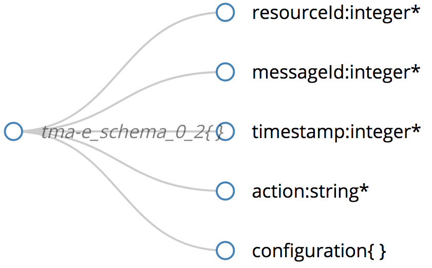

# Execute Component @ TMA Framework

The key components of the of the [**ATMOSPHERE**](http://www.atmosphere-eubrazil.eu) ecosystem will provide adaptation mechanisms to cope with the trustworthiness level goals.
These mechanisms are controlled by `actuators` which are in turn invoked by the `TMA_Execute`. 

Although the development of each `actuator` depends on the component with which it integrates, all the `actuators` will follow a standard architecture and provide a similar interface in order to integrate with the `TMA_Execute`. 

The messages to be submitted from `TMA_Execute` to one `actuator` follow the `JSON` schema specified in [tma-e_schema](interface/atmosphere_tma-e_schema.json), which is currently in the version `0.2`.

The [figure below](interface/atmosphere_tma-e_schema.png)  presents a representation of this schema, which is also explained below. 

*Format of the data to be provided to the actuator components.*

Each message will include:

* `resourceId` -- identifies the resource to which the adaptation is targeted
* `messageId` -- control information 
* `timestamp` -- control information 
* `action` -- identifies the adaptation to be promoted by the actuator
* `configuration` -- configuration data for the `action`, which can be included in the form of a JSON object.

`Actuators`, `actions` and respective `configuration` data must be configured in the system, and saved in the knowledge base. 
`Actuators` can be added by the administrator that should add information about them, including the types of available adaptations, foreseen effects and the definition of rules that specify if one adaptation should be triggered.

